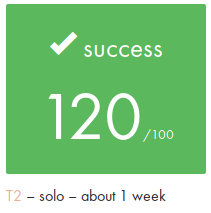

# ft_ssl_md5 - ft_ssl_des

Project developer in C

The program ft_ssl_md5 reproductible openssl function for md5, sha256, sha224, des-ecb,
des-cbc, des-pcbc, des3-ecb, des3-cbc, des3-pcbc
  
For test using OpenSSL 1.0.0s 11 Jun 2015

### Usage
    - make

### Test
    - sh ./test_all.sh

##### ft_ssl_md5

##### ft_ssl_des

